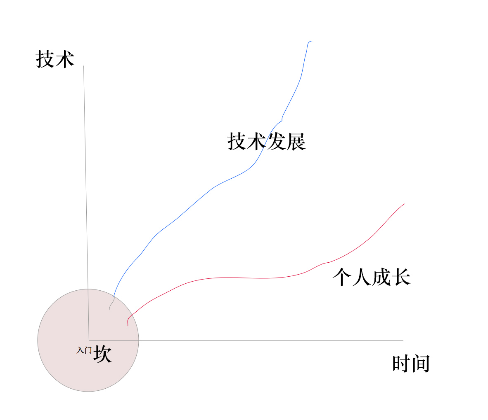
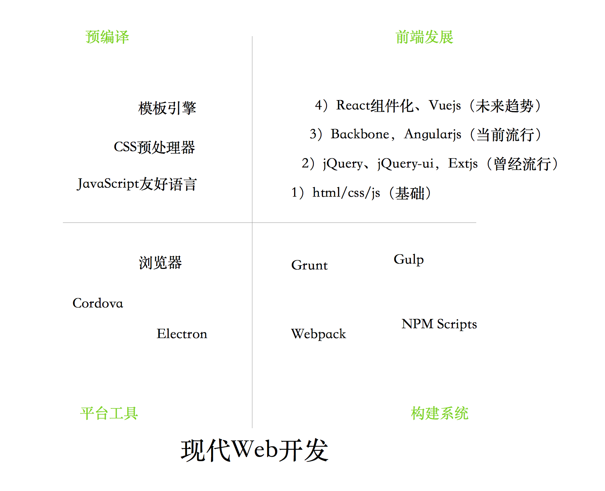
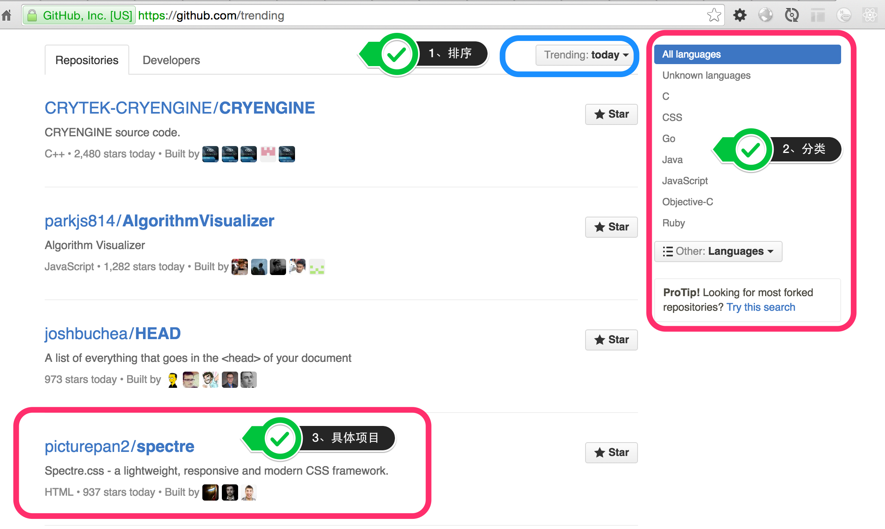
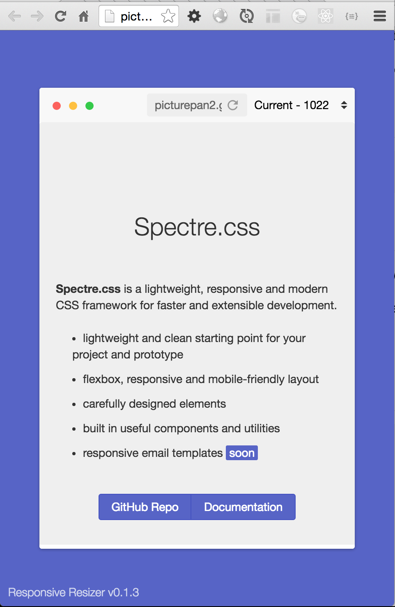
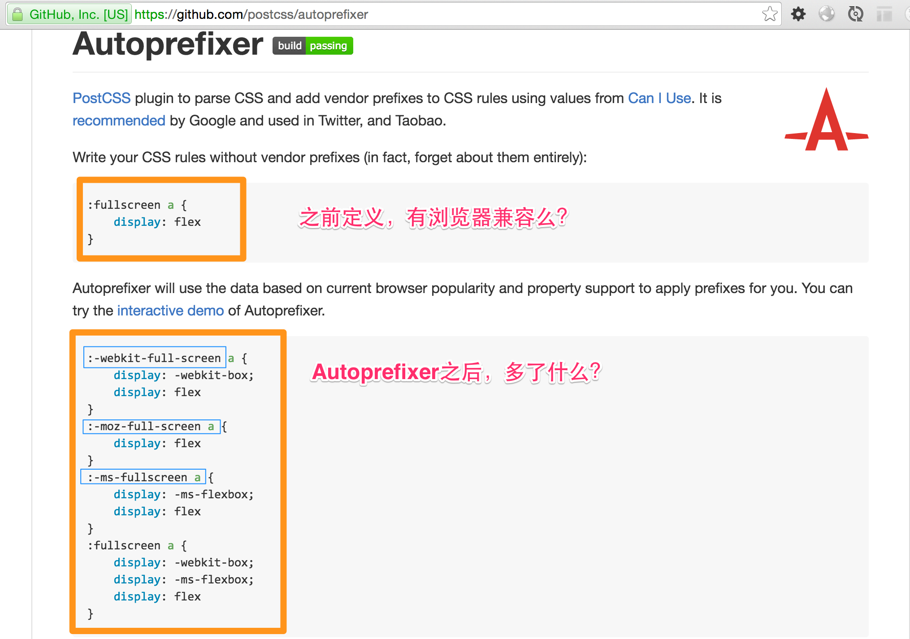
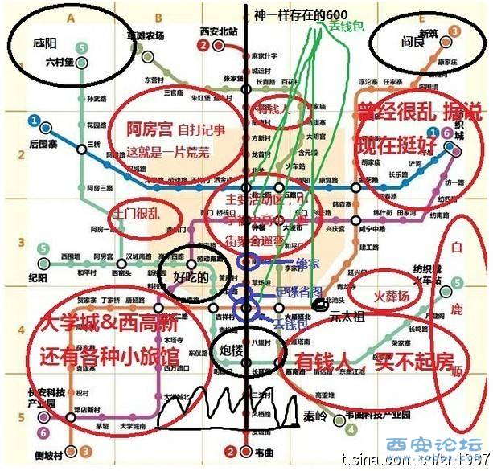
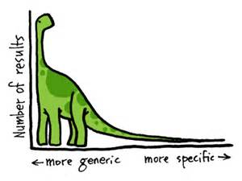

# Study-For-StuQ


## 为什么前端越来越难？越来越好玩？



## 现代web开发



## 关于目标

我的观点

```
没有人就朝“钱”看，有目标就朝“前”看
```


现状：前端正在越来越复杂，这是挑战也是机遇

```
钱端 ≈ 前端
```

## 这么多东西，学不完？

- 开源，有无数可学的，没事儿创造事儿
- 创造，自己写，总有无数种需求
- 人生不只有编程，其他技能也是非常有用的

## 善用github trending

https://github.com/trending

查找



1. 默认排序是今天，还有周和月
1. 按照语言分类
1. 找到自己喜欢或关注的项目

## picturepan2 / spectre


Spectre.css - a lightweight, responsive and modern CSS framework.

```
HTML • 937 stars today • Built by  @picturepan2  @marcobiedermann  @roybarber
```

核心要点

- CSS framework
- lightweight
- responsive
- modern

### 先看它是什么？

Spectre.css is a lightweight, responsive and modern CSS framework for faster and extensible development.

- lightweight and clean starting point for your project and prototype
- flexbox, responsive and mobile-friendly layout
- carefully designed elements
- built in useful components and utilities
- responsive email templates (soon)

Spectre is a side project based on years of CSS development work on a large web service project. Spectre only includes modern base styles, responsive layout system, CSS components and utilities, and it can be modified for your project with LESS compiler.


### Getting started即入门

3种安装方法

Install manually

    Download the compiled and minified Spectre CSS file.

Install with NPM

    $ npm install spectre.css

Install with Bower

    $ bower install spectre.css


具体用法

And include it in your website or Web app <head> part.

    <link rel="stylesheet" href="dist/spectre.min.css" />

### Compiling custom version定制


You can compiling your custom version of Spectre.css. Read the documentation.

[文档](http://picturepan2.github.io/spectre/#elements)里说

Spectre uses Gulp for compiling CSS. You can customize your version of Spectre.css by editing LESS files in /src directory or removing unneeded components from spectre.less.

Then, you can build the CSS file from the command line:

1. Navigate to the root directory of Spectre where you can find package.json file.
1. Run npm install. NPM will install all dev dependencies as listed in package.json.
1. When completed, run gulp build to compile LESS to CSS and minify files.
1. You can find compiled CSS files in /dist directory.

You can watch file changes and rebuild CSS files by using gulp watch.

其实就是通过gulp各种组合把less编译成css，less里各种变量、主题、函数等

### Documentation and demos各种例子，学习最简单的办法

分了4类

- Elements
- Layout
- Components
- Utilities

### 要不要为了演示方便，写一个Tools？

Responsive Resizer - responsive test tool

http://picturepan2.github.io/spectre/tools/resizer




### Browser support 兼容浏览器

Spectre uses Autoprefixer to make most styles compatible with earlier browsers and Normalize.css for CSS resets. Spectre is designed for modern browsers. For best compatibility, these browsers are recommended:

- Chrome (last two)
- Edge (last two)
- Firefox (last two)
- Internet Explorer 10+
- Microsoft Edge
- Opera (last two)
- Safari 6+


估计有很多人会有2个点不是特别了解

- [Autoprefixer](https://github.com/postcss/autoprefixer)
- [Normalize.css](https://necolas.github.io/normalize.css/)

### 延伸autoprefixer



看一眼，文档是不是就能明白点什么？

### 附加维护人信息

Currently maintained by Yan Zhu. Feel free to submit a pull request. Help is always appreciated.

### 比较，在心里画地图

- 还有同类型的项目么？
- 它的优点与缺点、差异点等
- 什么场景使用更合适？

来一张比较恶俗的图



### 关于代码


## 知行合一，勇于早轮子

《传习录》里说

```
知是行之始，行是知之成。若会得时，只说一个知，已自有行在；只说一个行，已自有知在。古人所以既说一个知，又说一个行者，只为世间有一种人，懵懵懂懂的任意去做，全不解思惟省察，也只是个冥行妄作，所以必说个知，方才行得是。又有一种人，茫茫荡荡悬空去思索，全不肯着实躬行，也只是个揣摸影响，所以说一个行，方才知得真。此是古人不得已补偏救弊的说话。若见得这个意时，即一言而足。今人却就将知行分作两件去做，以为必先知了，然后能行。我如今且去讲习讨论做知的工夫，待知得真了，方去做行的工夫。故遂终身不行，亦遂终身不知。此不是小病痛，其来已非一日矣。某今说个知行合一，正是对病的药，又不是某凿空杜撰。知行本体原是如此。今若知得宗旨时，即说两上亦不妨，亦只是一个。若不会宗旨，便说一个，亦济得甚事？只是闲说话。
```

看了这么多东西，学了这么多东西，最终目的是啥呢？

创造，才是自我价值实现的最好途径

- 工具类，随手用，随手写，以前为了写书，写了无数写文档的工具
- 最小化，精简，只为求原理、真知
- 总结最佳实践，自己写类库、框架设计

直白点总结，你做这些就是为了积累自信，勇于直面惨淡多变的编程人生，让一件无聊的事儿变得有趣

应变是一个人的能力价值的最大体现，如果再加上非常好的敬业态度，就是人才。

## 警惕：长尾理论



- 长尾（Long Tail）
- generic 普通的；通有的；一般的
- specific 详细而精确的；明确的；详尽的；清楚的

## 合理安排时间，做一个有意思的人

《菜根谈》上的原文这样写道：“天地寂然不动，而气机无息稍停；日月尽夜奔驰，而贞明万古不易。故君子闲时要有吃紧的心思，忙处要有悠闲的趣味。”

爱玩没错、装逼没错，如果爱玩、装逼和工作结合到一起，那就是乐趣。

## 少抱怨，多思考，未来更美好 

```
痛苦不是价值，解决问题才是真正的价值
```


